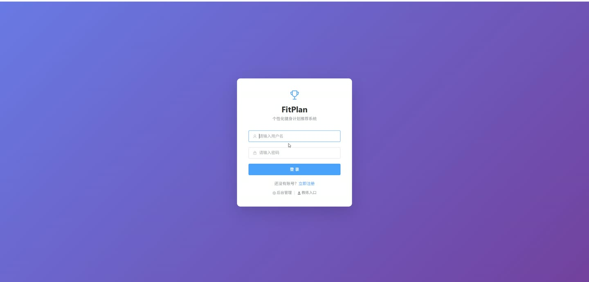
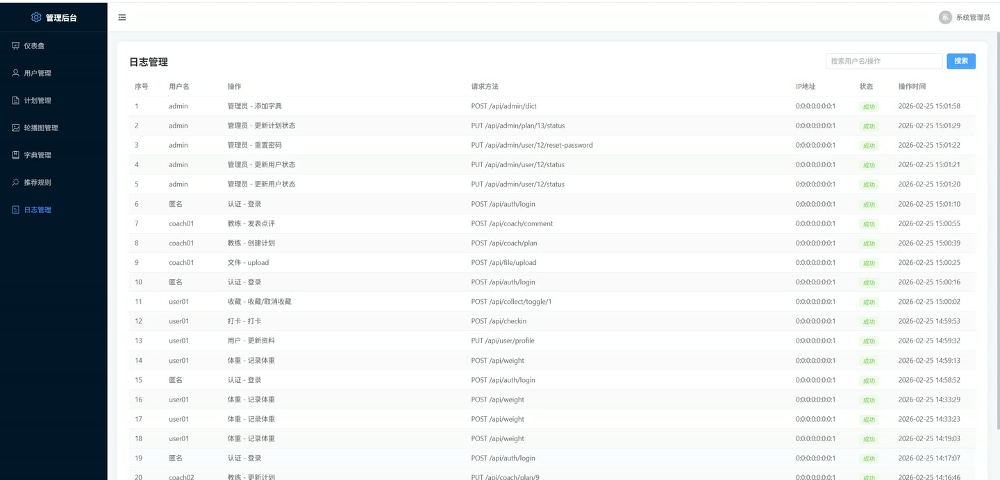
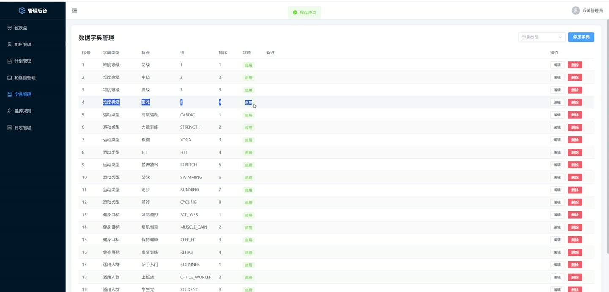

# (附文档)Springboot3+Vue3+MySQL 个性化健身计划推荐系统

**技术栈**：Springboot3、Vue3、MySQL

### 系统简介

本系统是一个基于Spring Boot 3 + Vue 3 + MySQL的个性化健身计划推荐平台，采用前后端分离架构，支持普通用户、教练和管理员三种角色。系统通过分析用户的身体数据（BMI、运动偏好、健身目标）实现个性化计划推荐，并提供计划管理、打卡记录、体重追踪、教练点评等完整功能闭环。
 
### 核心功能
 
### 普通用户端

 
- 用户注册/登录（支持用户名密码认证，教练注册需填写专长和资质证书） 
- 浏览健身计划列表（支持按关键词、运动类型、难度、目标人群、健身目标筛选） 
- 查看计划详情（展示计划标题、描述、封面、运动类型、难度、时长、教练名称） 
- 查看计划动作列表（按天分组展示动作名称、图片、组数、次数、休息时间、技巧提示） 
- 收藏/取消收藏计划（点击切换收藏状态，收藏数实时更新） 
- 查看我的收藏列表（分页展示已收藏的健身计划） 
- 每日打卡（选择计划、评分1-5星、填写感受、记录运动时长，同一计划一天只能打卡一次） 
- 查看我的打卡记录（分页展示打卡历史，包含计划标题、打卡日期、评分） 
- 查看某计划的打卡记录（按计划筛选查看自己的打卡历史） 
- 记录体重（输入体重值，系统根据身高自动计算BMI，当天可覆盖更新） 
- 查看体重趋势（展示最近30天的体重变化曲线数据） 
- 查看运动统计数据（总打卡次数、收藏数、完成率、体重趋势、BMI趋势、最近打卡记录） 
- 查看个性化推荐列表（系统根据BMI、健身目标、运动偏好、运动时长自动推荐8个计划） 
- 查看推荐历史（展示历史推荐记录及对应的计划信息） 
- 编辑个人资料（修改昵称、手机号、头像、性别、身高、体重、体脂率、健身目标、运动时长、运动类型偏好） 
- 修改密码（需验证旧密码） 
- 查看教练对我的点评列表（展示教练昵称、点评内容、时间） 
- 查看首页轮播图（展示状态为启用的轮播图列表）
 
### 教练端

 
- 查看我发布的计划列表（分页展示自己创建的健身计划） 
- 创建新计划（填写标题、描述、封面、运动类型、难度、总时长、单次时长、目标人群、健身目标，并添加每日动作详情） 
- 编辑已有计划（修改计划信息及动作列表，自动删除旧动作重新插入） 
- 删除计划（仅能删除自己创建的计划） 
- 查看普通用户列表（支持按用户名/昵称/手机号搜索，仅显示启用状态的用户） 
- 查看用户的打卡记录（按用户ID查询其所有打卡历史） 
- 查看用户的身体数据（身高、体重、BMI、体脂率等） 
- 对用户发表点评（选择用户和计划，填写点评内容） 
- 查看我的点评列表（按时间倒序展示自己发表的所有点评） 
- 查看某用户的点评列表（按用户ID查询所有教练对该用户的点评，并显示教练昵称） 
- 查看计划统计数据（按收藏数倒序展示自己发布的所有计划）
 
### 管理员端

 
- 分页查询用户列表（支持按关键词、角色、状态筛选，排除管理员账号） 
- 新增用户（手动添加用户，可设置角色为普通用户或教练，默认密码123456） 
- 更新用户状态（启用/禁用用户账号） 
- 审核教练资质（通过/驳回教练入驻申请） 
- 删除用户 
- 重置用户密码（重置为123456） 
- 轮播图管理（添加、编辑、删除轮播图，支持设置标题、图片、链接、排序） 
- 数据字典管理（添加、编辑、删除字典项，按字典类型筛选） 
- 推荐规则管理（添加、编辑、删除推荐规则，支持设置BMI范围、难度、时长、权重分数） 
- 手动刷新推荐（触发所有用户的个性化推荐重新计算） 
- 计划管理（查看所有计划列表，支持上架/下架操作） 
- 日志管理（分页查看操作日志，支持按用户名或操作内容搜索） 
- 仪表盘统计（展示总用户数、总教练数、总计划数、总打卡数、用户增长趋势、计划热度排行、运动类型分布）
 
### 技术栈

 后端框架Spring Boot 3.x ORMMyBatis-Plus 权限认证Spring Security + JWT 前端框架Vue 3 状态管理Pinia / Vuex 构建工具Vite 数据库MySQL
 
### 交付内容

 
- 后端完整源码 
- 前端完整源码 
- 数据库初始化脚本 
- 万字文档

## 界面展示

---

## 获取完整源码 + 万字文档

本仓库为项目介绍页。**完整前后端源码、数据库初始化脚本、万字项目文档**，请加微信 `kangkangcode`，或访问 [codekk.top](http://codekk.top) 获取。

可作课程设计 / 毕业设计参考，支持远程部署调试。